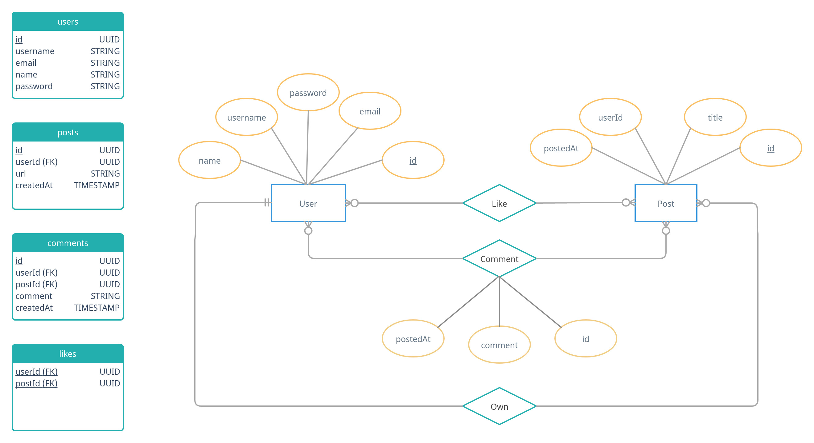

# Codersquare
Codersquare is a social web app for sharing learning resources in [hacker news](https://news.ycombinator.com/) style by making posts with avilability to comments on as well as votes/likes.

It's and implementation of the original [Codersquare](https://github.com/yebrahim/codersquare) prject in javascript and nodejs with express.

## Server
A simple HTTP server is responsible for authentication using JWT, serving stored data, and potentially ingesting and serving analytics data.

**Used technologies:** Javascript, Node.js, Express.js, Sequelize, Jest

## API
You can find a file for swagger API documentation [here](./docs/swagger/AHMEDZAHER1307-codersquare-1.0.0-resolved.yaml).

**Users:**
```
/users/login [POST]
/users/signup  [POST]
```
**Posts:**
```
/posts/:id [GET]
/posts/:id [DELETE]
/posts/    [POST]
/posts/    [GET] 
```
**Comments:**
```
/comments/:id [GET]
/comments/:id [DELETE]
/comments/    [POST]
```
**Likes:**
```
/likes/:id [GET]
/likes/    [DELETE]
/likes/    [POST]
```

## Database
We'll use a relational database (schema follows) with sqlite3.
### Schema:


## How to use
- **First you need to clone the repo:**
```sh
$ git clone https://github.com/Zaher1307/codersquare.git
```
- **Install dependencies**
```sh
$ npm install 
```
- Start server -> *will listen on port 3000*
```sh
$ npm start
```
Finally you can use [postman](https://www.postman.com/) or build your client to test this API or you can use this client [codersquare](https://github.com/hazemelfeky/codersquare).
